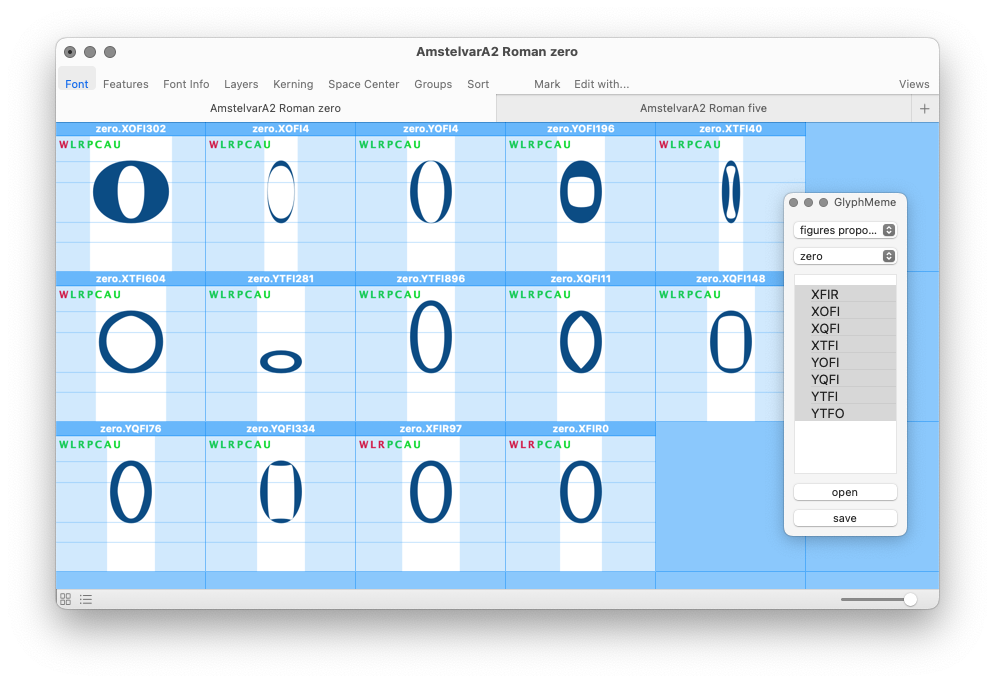

Editing AmstelvarA2 with GlyphMeme
==================================

Introduction
------------

A “glyph meme” is a high-level description of the parameters involved in the creation of a glyph in all its variations – like a list of ingredients, and where to find them.

The GlyphMeme tool is a first experimental implementation of this idea. It uses existing data to find which sources are involved in the design of a given glyph; and it allows us to open *only this glyph from only those sources* into a temporary font for editing, and then saving them back to the source where they belong.

This approach provides two major benefits to the parametric design workflow:

1. It allows the designer to focus his attention, by showing only the relevant parametric glyph sources side-by-side and nothing else.
2. It greatly speeds up the production process by avoiding the performance bottleneck of opening multiple full font sources at once.

Using the GlyphMeme tool
------------------------

This first implementation of the tool is custom-made for the AmstelvarA2 sources, so it knows where to find the data files that it needs. A general-purpose tool would require the user to select these resources manually.

### Required data files

| data format        | what it is used for                                               |
|--------------------|-------------------------------------------------------------------|
| designspace        | finding individual font sources                                   |
| smarts sets        | selecting a glyph for editing                                     |
| measurements       | finding which parameters participate in the variations of a glyph |

### Step-by-step

1. Open the GlyphMeme palette by runing the script  `Tools/GlyphMeme.py` in RoboFont’s Scripting Window. 

2. Use the first drop-down menu to select a group of glyphs, and the second one to choose one glyph for editing.

3. Select which parameters of this glyph you would like to edit.

4. Click the “open” button to import glyphs from the corresponding sources into a temporary font.

5. Multiple glyphs can be opened this way, with one temporary font for each.

6. Edit glyphs as needed, and then use the “save” button to export the selected glyphs back to their UFOs. 

### Usage with other tools

The [GlyphValidator] and [Measurement] tools in the latest xTools4 have been patched to make them compatible with temporary fonts created by GlyphMeme.

[AmstelvarA2 repository]: #
[GlyphValidator]: #
[Measurement]: #
